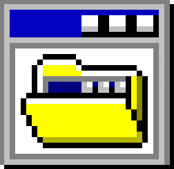

# Awesome Web Desktops 

The web's biggest curated directory of apps, portfolios and experiments that mimic the appearance and functionality of desktop operating systems, these are commonly known as [Web Desktops](https://en.wikipedia.org/wiki/Web_desktop).

 The links are [actively monitored](https://github.com/syxanash/wd-watcher) but if you notice a dead link or would like to contribute with your own creation you're more than welcome to do so, see [contribution guide](contributing.md). 

 Read my [blog post](https://system31.simone.computer/blog/desktops-zip) about this project!

  
Disclaimer

   Seizure warning: some of these websites may contain flashy animations. Viewer discretion is advised.
  
   Some of these websites may include elements related to **cryptocurrencies**. I **do not endorse** any cryptocurrency products or services, and inclusion of such content does not reflect my personal views. These websites have been added solely for the aesthetic purpose of being web desktops. Users are encouraged to conduct their own research before engaging with any cryptocurrency-related content or services found within this list.

## Contents

- [Websites](#websites)
- [Archived](#archived)

## Websites

| Site name | Source code |
| --- | --- |
[WorldWideWeb](https://worldwideweb.cern.ch/browser) |  private |
[Nightwave Plaza](https://plaza.one) | [ available](https://github.com/nightwaveplaza) |
[Poolsuite](https://poolsuite.net) |  private |
[Ash Kyd](https://ash.ms) | [ available](https://github.com/AshKyd/ui95) |
[Cyberspace & Time](http://cyberspaceandtime.com/Gaano9Y6KAU.video+related) |  private |
[WWWTXT](https://wwwtxt.org/about) |  private |
[Windows 93](https://www.windows93.net) | [ available](https://github.com/windows93dotnet/sys42) |
[The Restart Page](http://www.therestartpage.com) |  private |
[Webamp](https://webamp.org) | [ available](https://github.com/captbaritone/webamp) |
[It is as if you were doing work](https://pippinbarr.github.io/itisasifyouweredoingwork) | [ available](https://github.com/pippinbarr/itisasifyouweredoingwork) |
[Geek Prank](https://geekprank.com) |  private |
[Eric Bernacchi](http://eeerik.com) |  private |
[OS.js](https://demo.os-js.org) | [ available](https://github.com/os-js/OS.js) |
[Mariano Pascual](http://www.marianopascual.me) |  private |
[AfterStep WM](http://www.afterstep.org) |  private |
[98.js](https://98.js.org) | [ available](https://github.com/1j01/98) |
[Broken Reality](https://brokenrealitygame.tumblr.com) |  private |
[WindowMaker](https://www.windowmaker.org) |  private |
[Whimsy Space](https://whimsy.space) | [ available](https://github.com/STRd6/zine) |
[WinXP](https://winxp.now.sh) | [ available](https://github.com/ShizukuIchi/winXP/) |
[zach.dev // Software & Adventure](https://zach.dev) |  private |
[www.chiptune.com](http://www.chiptune.com) |  private |
[mattOS](https://mattos-1.webflow.io) |  private |
[waller.is](https://waller.is) |  private |
[Windows 98 Icon Viewer](https://win98icons.alexmeub.com) |  private |
[Jurassic Systems](https://jurassicsystems.com) | [ available](https://github.com/tojrobinson/jurassicsystems.com) |
[The Macpaint Gallery](http://www.macpaint.org) |  private |
[N10.AS RADIO](http://www.n10.as) |  private |
[Rahul.io](https://rahul.io) | [ available](https://github.com/lolstring/window98-html-css-js) |
[EmuOS](https://emupedia.net/beta/emuos/) | [ available](https://github.com/Emupedia/emupedia.github.io) |
[AaronOS](https://aaronos.dev/AaronOS/aosBeta.php) | [ available](https://github.com/MineAndCraft12/AaronOS) |
[CloudDesk](http://altaica.altervista.org) |  private |
[Windows 98 -- Packard Belle](https://packard-belle.netlify.app) | [ available](https://github.com/padraigfl/packard-belle-desktop) |
[vue win3.1](https://disjfa.github.io/vue-win-3.1/) | [ available](https://github.com/disjfa/vue-win-3.1) |
[Minesweeper](https://winmine-exe.now.sh) | [ available](https://github.com/1000hz/winmine-exe) |
[Gamithra OS](https://gamithra.com) |  private |
[maple's website!](https://maple.pet) |  private |
[baz's PC](https://niceware.neocities.org) |  private |
[Victor Ribeiro](https://victorribeiro.com) | [ available](https://github.com/victorqribeiro/fos) |
[Hillary Churchill - Copywriter](http://hillarychurchill.com) |  private |
[Bill's World Wide Boutique](https://billsworld.neocities.org) |  private |
[NyjaOS](https://signal3.neocities.org) |  private |
[Windows 95 Replica](https://derplayer.neocities.org/repo/win/) |  private |
[The Indie Web](https://theindieweb.com) | [ available](https://github.com/tholman/tholman-blog) |
[hannah blair \| developer & designer](https://hannahblair.co.uk) |  private |
[98 KAGE](https://ka.ge) | [ available](https://github.com/pkage/98) |
[erdOS](https://erd-os.iamerd.xyz) |  private |
[Windows 1.0](https://win1.krnl386.com) |  private |
[glenda.party](https://glenda.0x46.net) |  private |
[VirusvAV](https://os.virusav.com) |  private |
[Repeater](https://repeater.space) |  private |
[WuerfelDev](https://wuerfeldev.de) |  private |
[Make WordArt](https://makewordart.com) |  private |
[ytOS](https://ytcracker.com) |  private |
[Windows XP](https://windows-xp.netlify.app) |  private |
[56k-modem](https://56k-modem.online) |  private |
[RACER TRASH](https://racertrash.com) |  private |
[Vuindows](https://marcmascarell.github.io/Vuindows) | [ available](https://github.com/marcmascarell/Vuindows) |
[Gustavo Chico](https://gustavochico.com/desktop) |  private |
[digital-r41n](https://digital-r41n.neocities.org) |  private |
[Online Hacker Simulator](https://pranx.com/hacker/) |  private |
[Tetrageddon Games](http://tetrageddon.com) |  private |
[My Second PC](https://koas.dev/m2pc) | [ available](https://github.com/koas/my-second-pc) |
[ToxicCode.com](http://toxiccode.com) |  private |
[HyNET Geocity](https://hyena.network/geocity/) |  private |
[Unremarkable Garden](https://unremarkablegarden.com) |  private |
[FLEXEDUPSHAWTY.COM](https://flexedupshawty.com) |  private |
[H2O - OS](https://aconfuseddragon.neocities.org) |  private |
[RaccOS 9](https://violet.pm) |  private |
[daedalOS](https://dustinbrett.com) | [ available](https://github.com/DustinBrett/daedalOS) |
[MSOS Concept](https://msos.midspike.com) |  private |
[Team3D](https://team3d.io) |  private |
[Day Job](https://dayjob.work) |  private |
[PUBLIC DOMAIN](https://public---domain.com) |  private |
[WE=LINK](http://we-link.chronusartcenter.org) |  private |
[Thoughts On Glitch[Art]v2.0](http://nickbriz.com/thoughtsonglitchart) | [ available](https://github.com/nbriz/thoughtsonglitchart) |
[Big Desk Energy](https://www.bigdeskenergy.com) |  private |
[Github95](https://github95.now.sh) | [ available](https://github.com/edwardpayton/github95) |
[Yahya J. Aifit](https://yja.me) |  private |
[jQuery Desktop](https://desktop.sonspring.com) | [ available](https://github.com/nathansmith/jQuery-Desktop) |
[Windows 96](https://windows96.net) |  private |
[The Coding Forge](https://thecodingforge.com.au) | [ available](https://github.com/Yalgie/website) |
[Vivek Patel - Computer Science Student](https://vivek9patel.github.io) | [ available](https://github.com/vivek9patel/vivek9patel.github.io) |
[Winampify](https://winampify.io) | [ available](https://github.com/remigallego/winampify) |
[Try Andy's Desk](https://desk.glitchy.website) | [ available](https://github.com/KaeruCT/desk.glitchy.website) |
[tildeOS](https://tilde.town/~selfsame/) |  private |
[Jack Adam](https://jackadam.cc) | [ available](https://github.com/jckdm/jckdm.github.io) |
[Xiaohan Zou's Portfolio](https://portfolio.zxh.me) | [ available](https://github.com/Renovamen/playground-macos) |
[macOS in Svelte](https://macos-web.app) | [ available](https://github.com/puruvj/macos-web) |
[Deepin Linux](https://goodmanwen.github.io/) | [ available](https://github.com/GoodManWEN/GoodManWEN.github.io) |
[Win7](https://khang-nd.github.io/win7) | [ available](https://github.com/khang-nd/windows7) |
[Heather Vandervecht](https://heathervv.com) | [ available](https://github.com/heathervv/portfolio-chatbot) |
[Tony Dinh](https://dinhquangtrung.net/windows7/) | [ available](https://github.com/trungdq88/dinhquangtrung.net) |
[Fizzygum](http://fizzygum.org/sandboxes/latest-stable/) | [ available](https://github.com/davidedc/Fizzygum) |
[Win11React](https://win11.blueedge.me/) | [ available](https://github.com/blueedgetechno/win11React) |
[Win7 Simu](https://win7simu.visnalize.com) |  private |
[AtheOS](https://al1-ce.neocities.org) |  private |
[NeXT](https://www.levenez.com/NeXTSTEP/) |  private |
[Don chia](https://www.donchia.tech) | [ available](https://github.com/dhs17y2adonchia/win95) |
[LUMISET](https://lumiset.se) |  private |
[clickbecause.net](https://clickbecause.net) |  private |
[9/11 Realtime](https://911realtime.org) | [ available](https://github.com/robbiebyrd/rt911) |
[Core-OS](https://coreos.io) | [ available](https://github.com/timhow38/Resume-WebApplication) |
[Frank Force - Generative Art](https://generative.3d2k.com) | [ available](https://github.com/KilledByAPixel/OS13k) |
[Noam Rubin](https://www.noam-rubin.com) |  private |
[Insaf Khamzin](https://insafkhamzin.com) | [ available](https://github.com/InsafKhamzin/portfolio) |
[Jonathan Zavialov](https://computer.jonzav.me) | [ available](https://github.com/JonZavialov/portfolio4) |
[KANYE 2049](https://kanye2049.com/) (password: `Graduation`) |  private |
[Windows 11 in Preact](https://win11.vercel.app) | [ available](https://github.com/piyushsuthar/windows-11-web) |
[RebornXP](https://xp.quenq.com) | [ available](https://github.com/shoaib-jamal/rebornxp) |
[WWWerd](https://theoldnet.com/desktop/) | [ available](https://github.com/TheOldNet/web-windows) |
[Puter](https://puter.com) | [ available](https://github.com/heyPuter/puter/) |
[Things](https://things.inc) |  private |
[1997box](https://1997.pooftie.me) | [ available](https://github.com/middlepot/1997) |
[FoundationOS](https://os.foundation.app) |  private |
[Orb](https://desktop.leisink.net) | [ available](https://gitlab.com/hsleisink/orb) |
[Classicy](https://robbiebyrd.github.io/classicy/) (was Platinum) | [ available](https://github.com/robbiebyrd/classicy) |
[Harrison's Home](https://harrisonm.com) |  private |
[Janne Koivisto](https://janneilkka.com) |  private |
[Kayo Felipe Silva](https://kaiofelipejs.dev) | [ available](https://github.com/kaiofelipejs/kaiofelipejs.dev) |
[H4CK1NG G00GL3](https://h4ck1ng.google) |  private |
[Sam Likes Code](https://samlikescode.dev) | [ available](https://github.com/Goggwell/newfolio/) |
[The Amiga Workbench Simulation](https://taws.ch) |  private |
[Amiga34 Germany](http://www.amiga34.de/WB.html) |  private |
[Richard Eisenmenger](https://amiga.richard-eisenmenger.com/WB.html) |  private |
[Money Simulator](https://simulator.money/play) |  private |
[Pangolin Desktop](https://web.dahliaos.io) | [ available](https://github.com/dahliaOS/pangolin_desktop) |
[WebXP](https://konsti.club/webSys/) |  private |
[HoleNet Cobalt](https://holenet.info) |  private |
[Chrisbin's MacBook Pro](https://chrisbinsunny.github.io/chrishub) | [ available](https://github.com/chrisbinsunny/chrishub) |
[Ignasi Monreal](https://www.ignasimonreal.com) |  private |
[Jazmin Jones](https://www.jazminjones.com) |  private |
[Mastodon Flock](https://mastodon-flock.vercel.app/desktop) | [ available](https://github.com/WesSouza/mastodon-flock) |
[Ɀeus' Stadt](https://zeusofthecrows.neocities.org) | [ available](https://github.com/ZeusOfTheCrows/zeusofthecrows.github.io) |
[Win11 Svelte](https://win11-svelte.vercel.app) | [ available](https://github.com/yashash-pugalia/win11-svelte) |
[Sergio Diaz Schiaffino](https://www.sergiodiazschiaffino.com) |  private |
[chloédigital](https://chloedigital.com) |  private |
[The Secret History of Mac Gaming](https://secrethistoryofmacgaming.com) |  private |
[Ubuntu Tour](https://malisipi.github.io/ubuntu-tour) | [ available](https://github.com/malisipi/ubuntu-tour) |
[sue roh](https://sueroh.com) |  private |
[Windows 11 Web](https://rajaniraiyn.github.io/windows11/) | [ available](https://github.com/Rajaniraiyn/windows11) |
[Sophia's Time Capsule](https://sosophia10.github.io/Time-Capsule/index/desktop.html) | [ available](https://github.com/sosophia10/Time-Capsule) |
[Quentin OS/2](https://www.quentin.xyz) |  private |
[Hypertalking](https://www.hypertalking.com) |  private |
[DOODAD](https://doodad.dev) |  private |
[Joy Yiu](https://www.joyyiu.com) |  private |
[DeskPortal](https://demo.deskportal.com) |  private |
[lover.os](https://lostlove.neocities.org) |  private |
[Buddy Pond](https://buddypond.com) | [ available](https://github.com/marak/buddypond) |
[thatDaria](https://thatdaria.com) |  private |
[Chads Desktop](https://chadhill.dev) | [ available](https://github.com/chad2320/chadhill-dev) |
[Game Database](https://refuge.tokyo) |  private |
[GreyOS](https://greyos.gr) (login: `demo@greyos.gr` / `password`) | [ available](https://github.com/g0d/GreyOS) |
[Henry Heffernan](https://henryheffernan.com) | [ available](https://github.com/henryjeff/portfolio-website) |
[Alec Babala](https://www.alecbabala.com) |  private |
[win32.run](https://win32.run) | [ available](https://github.com/ducbao414/win32.run) |
[Pretty Diff](https://prettydiff.com) | [ available](https://github.com/prettydiff/share-file-systems) |
[Slashdiv OS](https://slashdiv.neocities.org) |  private |
[MacOS Big Sur Clone](https://macos-big-sur-clone.vercel.app) | [ available](https://github.com/mirayatech/macos-big-sur-clone) |
[NENRIKIDO](https://nenrikido.neocities.org) | [ available](https://github.com/js044/nenrikido/) |
[holidayOS \| tonik](https://holidayos-tonik-showcase.webflow.io) |  private |
[Rimet Desktop](http://geocities.ws/nooz/rimet/) |  private |
[exaequOS](https://www.exaequos.com/start.php) | [ available](https://github.com/baudaux/exa-kernel) |
[vue-95](https://johnuberbacher.com/vue95) | [ available](https://github.com/johnuberbacher/vue-95) |
[mingde](https://mingde.prussia.dev) | [ available](https://github.com/stjet/mingde) |
[BénOS](https://benlacroix.com) |  private |
[Pluto](https://pluto-app.zeon.dev) | [ available](https://github.com/zeondev/pluto) |
[webKDE](https://baroxyton.github.io/webKDE/) | [ available](https://github.com/baroxyton/webKDE) |
[Laurus Edelbacher](https://www.laurusedelbacher.com/new_page.html) |  private |
[.solutionsOS](https://gleb.solutions) |  private |
[Digital New Era](https://newerawebsites.com) |  private |
[C'est l'IA ou Célia](https://voeux2024.castoretpollux.com) |  private |
[HeavenComputerOS](https://heaven.computer) |  private |
[Bianca Mkaila](https://bianca.digital) |  private |
[racOS](https://rac.fm) |  private |
[HIFI Labs OS](https://hifilabs.co) |  private |
[Based](https://www.based.gg) |  private |
[ModernActiveDesktop](https://www.ingan121.com/mad/) | [ available](https://github.com/Ingan121/ModernActiveDesktop) |
[l3S GR*S MOT$](https://www.lesgrosmots.com) |  private |
[constraint systems OS](https://csos.constraint.systems) | [ available](https://github.com/constraint-systems/csOS) |
[PeOS](https://picturelements.github.io/) | [ available](https://github.com/PicturElements/picturelements.github.io) |
[Tansoftware OS](https://tansoftware.com/os) |  private |
[Brunc.io](https://brunc.io) | [ available](https://github.com/bamanczak/bruncio) |
[KRAZAM OS](https://www.krazam.tv) |  private |
[FrugalOS](https://www.thefrugalgamer.net/programming/FrugalOS/) | [ available](https://github.com/FrugalGamer/FrugalOS) |
[32by32](https://32by32.com) |  private |
[Yosub Kim](https://www.yoyosub.com) |  private |
[louisthings.OS](https://portfolio.louisthings.com) |  private |
[Windo 8_1](https://cseriestechhero.github.io/kiosk-setup/services/redir/basepage8_1/session) | [ available](https://github.com/CSeriestechhero/kiosk-setup/tree/main/services/redir/) |
[Joey de Ruiter](https://joeyderuiter.me) | [ available](https://github.com/0xJ0EY/Portfolio-next) |
[Grovy Website](https://grovy.space) (goes offline sometimes) |  private |
[ProzillaOS](https://os.prozilla.dev) | [ available](https://github.com/prozilla-os/ProzillaOS) |
[JSDesk](https://mmuii.github.io/jsdesk/) | [ available](https://github.com/MMuii/jsdesk) |
[Kasius Next](https://bobuxstation.github.io/Kasius-Next/) | [ available](https://github.com/Bobuxstation/Kasius-Next) |
[Nestor Siré](https://nestorsire.com) |  private |
[mountainOS](https://broimluna.github.io/mountainOS/) | [ available](https://github.com/broimluna/mountainOS) |
[skyOS](https://broimluna.github.io/skyos/) | [ available](https://github.com/broimluna/skyos) |
[mellyeliu](https://mellyeliu.online) | [ available](https://github.com/mellyeliu/new-personal-website) |
[GopalOS](https://cerebraldatabank.neocities.org/gopalos) |  private |
[Windows 12 Web Edition](https://tjy-gitnub.github.io/win12/desktop.html) | [ available](https://github.com/tjy-gitnub/win12/blob/main/readme/README_en_us.md) |
[KOD Cloud](https://demo.kodcloud.com) | [ available](https://github.com/kalcaddle/KodExplorer) |
[The Little Green Desktop](https://www.atari.st) |  private |
[Strawbebby228 Desktop](https://strawbebby228.neocities.org) |  private |
[SRB](https://srb.neocities.org) |  private |
[Systems 01](https://systems01.com) |  private |
[hat.fo](https://hat.fo) | [ available](https://github.com/hatf0/hat.fo-next) |
[Nic Chan](https://www.nicchan.me) |  private |
[Windows 95 Portfolio](https://yuteoctober.github.io/wins95Portfolio/) | [ available](https://github.com/Yuteoctober/wins95Portfolio/) |
[An Ordinary Portfolio Page of Derya](https://deryasdesktop.com) |  private |
[HippoPlayer](https://hippoplayer.se/WB.html) |  private |
[purarue OS](https://purarue.xyz) | [ available](https://github.com/purarue/glue) |
[Sarah's Portfolio](https://www.webchef.dev) | [ available](https://github.com/WebChefDev/WebChefDev) |
[Ritenv's WebOS](http://riten.io/retro-desktop/) | [ available](https://github.com/ritenv/retro-desktop) |
[Vtron](https://vtron.site/win/) | [ available](https://github.com/royalknight56/vtron) |
[Koë's Desktop](https://koefka.com) |  private |
[Hawwokitty's Portfolio](https://hawwokitty.github.io/my-portfolio/) | [ available](https://github.com/hawwokitty/my-portfolio) |
[Ricardo98](https://ricardo-gomes.vercel.app) | [ available](https://github.com/sleiph/Portfolio) |
[Renkbench](http://www.renkbench.de) | [ available](https://github.com/renkman/Renkbench) |
[KodeKeras](https://kodekeras.my.id) |  private |

## Archived

See [Archived Web Desktops](archived.md)
