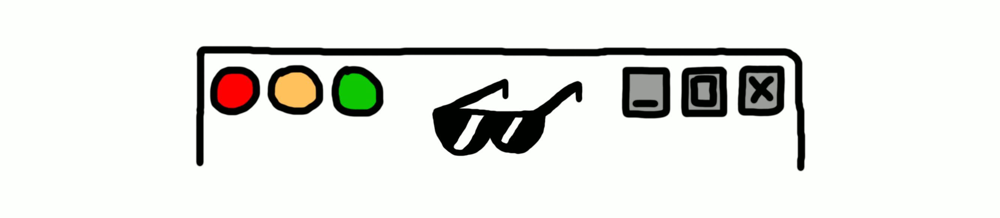

# Awesome Desktop GUI Websites 

I've always been a fan of websites, web apps and portfolios which resemble desktop computer graphical user interfaces so here is an **awesome curated list**!

- Contributions are more than welcome. Please see [contribution guide](contributing.md).

## Websites

* [WorldWideWeb](https://worldwideweb.cern.ch/browser)
* [Poolside FM](https://poolside.fm)
* [Nightwave Plaza](https://plaza.one)
* [Ash Kyd](https://ash.ms)
* [Cyberspace & Time](http://cyberspaceandtime.com/Gaano9Y6KAU.video+related)
* [WWWTXT](https://wwwtxt.org/about)
* [Windows 93](https://www.windows93.net)
* [Artur Bień](https://www.expensive.toys)
* [Enhance Computer](https://www.enhance.computer)
* [The Restart Page](http://www.therestartpage.com)
* [Webamp](https://webamp.org)
* [It is as if you were doing work](https://pippinbarr.github.io/itisasifyouweredoingwork)
* [frankenSim](https://frankensim.animade.tv)
* [Jack Kim](https://www.jackk.im)
* [BritneyOS'99](https://www.itsbritneybot.com)
* [Windows XP Simulator](https://geekprank.com/xp-simulator.php)
* [Eric Bernacchi](http://eeerik.com)
* [OS.js Demonstration](https://demo.os-js.org)
* [Mariano Pascual](http://www.marianopascual.me)
* [FVWM](http://www.fvwm.org)

## Author

* [Simone `syx` Marzulli](https://twitter.com/syxanash)

## License

