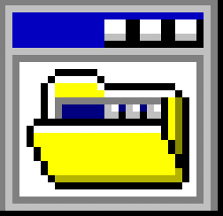

# Awesome Web Desktops 

If you are a fan of websites, web apps and portfolios which resemble desktop operating systems here is an **awesome curated list**!

- Contributions are more than welcome. Please see [contribution guide](contributing.md).
- To know more about web desktops you should read up the Wikipedia [article here](https://en.wikipedia.org/wiki/Web_desktop).
-  Hacker News discussion available [here](https://news.ycombinator.com/item?id=23734093)

## Websites

| Site name | Source code |
| --- | --- |
[WorldWideWeb](https://worldwideweb.cern.ch/browser) |  n/a |
[Nightwave Plaza](https://plaza.one) |  n/a |
[Poolsuite](https://poolsuite.net) |  n/a |
[Ash Kyd](https://ash.ms) | [ Available](https://github.com/AshKyd/ui95) |
[Cyberspace & Time](http://cyberspaceandtime.com/Gaano9Y6KAU.video+related) |  n/a |
[WWWTXT](https://wwwtxt.org/about) |  n/a |
[Windows 93](https://www.windows93.net) |  n/a |
[Artur Bień](https://www.expensive.toys) | [ Available](https://github.com/arturbien/React95) |
[The Restart Page](http://www.therestartpage.com) |  n/a |
[Webamp](https://webamp.org) | [ Available](https://github.com/captbaritone/webamp) |
[It is as if you were doing work](https://pippinbarr.github.io/itisasifyouweredoingwork) | [ Available](https://github.com/pippinbarr/itisasifyouweredoingwork) |
[frankenSim](http://frankensim.animade.tv) |  n/a |
[Jack Kim](https://www.jackk.im) |  n/a |
[Geek Prank](https://geekprank.com) |  n/a |
[Eric Bernacchi](http://eeerik.com) |  n/a |
[OS.js Demonstration](https://demo.os-js.org) | [ Available](https://github.com/os-js/OS.js) |
[Mariano Pascual](http://www.marianopascual.me) |  n/a |
[AfterStep WM](http://www.afterstep.org) |  n/a |
[98.js](https://98.js.org) | [ Available](https://github.com/1j01/98) |
[Broken Reality](https://brokenrealitygame.tumblr.com) |  n/a |
[WindowMaker](https://www.windowmaker.org) |  n/a |
[Whimsy Space](https://whimsy.space) | [ Available](https://github.com/STRd6/zine) |
[WinXP](https://winxp.now.sh) | [ Available](https://github.com/ShizukuIchi/winXP/) |
[zach.dev // Software & Adventure](https://zach.dev) |  n/a |
[www.chiptune.com](http://www.chiptune.com) |  n/a |
[Virtual Desktop](http://www.virtualdesktop.org) |  n/a |
[mattOS](https://mattos-1.webflow.io) |  n/a |
[waller.is](https://waller.is) |  n/a |
[Windows 98 Icon Viewer](https://win98icons.alexmeub.com) |  n/a |
[Jurassic Systems](https://jurassicsystems.com) | [ Available](https://github.com/tojrobinson/jurassicsystems.com) |
[The Macpaint Gallery](http://www.macpaint.org) |  n/a |
[N10.AS RADIO](http://www.n10.as) |  n/a |
[Rahul.io](https://rahul.io) | [ Available](https://github.com/lolstring/window98-html-css-js) |
[EmuOS](https://emupedia.net/beta/emuos/) | [ Available](https://github.com/Emupedia/emupedia.github.io) |
[AaronOS](https://aaronos.dev/AaronOS/aosBeta.php) | [ Available](https://github.com/MineAndCraft12/AaronOS) |
[CloudDesk](http://altaica.altervista.org) |  n/a |
[Windows 98 -- Packard Belle](https://packard-belle.netlify.com) | [ Available](https://github.com/padraigfl/packard-belle-desktop) |
[vue win3.1](https://disjfa.github.io/vue-win-3.1/) | [ Available](https://github.com/disjfa/vue-win-3.1) |
[Minesweeper](https://winmine-exe.now.sh) | [ Available](https://github.com/1000hz/winmine-exe) |
[Gamithra OS](https://gamithra.com) |  n/a |
[maple's website!](https://maple.pet) |  n/a |
[baz's PC](https://niceware.neocities.org) |  n/a |
[TrueSchool Ascii](https://www.trueschool.se) |  n/a |
[Victor Ribeiro](https://victorribeiro.com) | [ Available](https://github.com/victorqribeiro/fos) |
[Nirrius Creative Studio](https://nirri.us) |  n/a |
[Hillary Churchill - Copywriter](http://hillarychurchill.com) |  n/a |
[Bill's World Wide Boutique](https://billsworld.neocities.org) |  n/a |
[NyjaOS](https://signal3.neocities.org) |  n/a |
[Windows 95 Replica](https://derplayer.neocities.org/repo/win/) |  n/a |
[The Indie Web](https://theindieweb.com) | [ Available](https://github.com/tholman/tholman-blog) |
[hannah blair \| developer & designer](https://hannahblair.co.uk) |  n/a |
[98 KAGE](https://ka.ge) | [ Available](https://github.com/pkage/98) |
[erdOS](https://erd-os.iamerd.xyz) |  n/a |
[Windows 1.0](https://win1.krnl386.com) |  n/a |
[glenda.party](https://glenda.0x46.net) |  n/a |
[VirusvAV](https://os.virusav.com) |  n/a |
[some kind of blog](https://blog.aimen.me) |  n/a |
[Repeater](https://repeater.space) |  n/a |
[WuerfelDev](https://wuerfeldev.de) |  n/a |
[Glass Animals OPEN SOURCE](https://opensource.glassanimals.com) |  n/a |
[Make WordArt](https://makewordart.com) |  n/a |
[ytOS](https://ytcracker.com) |  n/a |
[Windows XP](https://windows-xp.netlify.app) |  n/a |
[56k-modem](https://56k-modem.online) |  n/a |
[RACER TRASH](https://racertrash.com) |  n/a |
[Vuindows](https://marcmascarell.github.io/Vuindows) | [ Available](https://github.com/marcmascarell/Vuindows) |
[Gustavo Chico](https://gustavochico.com/desktop) |  n/a |
[digital-r41n](https://digital-r41n.neocities.org) |  n/a |
[KryptOS](https://kry.pt/#OSVERSIONS) |  n/a |
[Online Hacker Simulator](https://hacker-simulator.com) |  n/a |
[Tetrageddon Games](http://tetrageddon.com) |  n/a |
[AWGE - Forum](https://forums.awgeshit.com) |  n/a |
[My Second PC](https://koas.dev/m2pc) | [ Available](https://github.com/koas/my-second-pc) |
[ToxicCode.com](http://toxiccode.com) |  n/a |
[HyNET Geocity](https://hyena.network/geocity/) |  n/a |
[Unremarkable Garden](https://unremarkablegarden.com) |  n/a |
[FLEXEDUPSHAWTY.COM](https://flexedupshawty.com) |  n/a |
[aconfuseddragon's art and nostalgia corner](https://aconfuseddragon.neocities.org) |  n/a |
[RaccOS 9](https://violet.pm) |  n/a |
[daedalOS](https://dustinbrett.com) | [ Available](https://github.com/DustinBrett/daedalOS) |
[MSOS Concept](https://msos.midspike.com) |  n/a |
[Novov - Software I use](https://novov.neocities.org/liked/software.html) |  n/a |
[Team3D](https://team3d.io) |  n/a |
[Day Job](https://dayjob.work) |  n/a |
[PUBLIC DOMAIN](https://public---domain.com) |  n/a |
[WE=LINK](http://we-link.chronusartcenter.org) |  n/a |
[Thoughts On Glitch[Art]v2.0](http://nickbriz.com/thoughtsonglitchart) | [ Available](https://github.com/nbriz/thoughtsonglitchart) |
[Big Desk Energy](https://www.bigdeskenergy.com) |  n/a |
[Github95](https://github95.now.sh) | [ Available](https://github.com/edwardpayton/github95) |
[An Ordinary Portfolio Page of Derya](https://deryasdesktop.com) | [ Available](https://github.com/D-Antonelli/portfolio) |
[linuxWeb](https://617d5c82f9d62b0007efa555--serene-bhabha-879d38.netlify.app) | [ Available](https://github.com/Manthee1/linuxWeb) |
[Yahya J. Aifit](https://yja.me) |  n/a |
[jQuery Desktop](https://desktop.sonspring.com) | [ Available](https://github.com/nathansmith/jQuery-Desktop) |
[Windows 96](https://windows96.net) |  n/a |
[The Coding Forge](https://thecodingforge.com.au) | [ Available](https://github.com/Yalgie/website) |
[Vivek Patel - Computer Science Student](https://vivek9patel.github.io) | [ Available](https://github.com/vivek9patel/vivek9patel.github.io) |
[Winampify](https://winampify.io) | [ Available](https://github.com/remigallego/winampify) |
[Try Andy's Desk](https://desk.glitchy.website) |  n/a |
[tildeOS](https://tilde.town/~selfsame/) |  n/a |
[Jack Adam](https://jackadam.cc) |  n/a |
[Xiaohan Zou's Portfolio](https://portfolio.zxh.io) | [ Available](https://github.com/Renovamen/playground-macos) |
[macOS in Preact](https://macos.vercel.app) | [ Available](https://github.com/puruvj/macos-web) |
[Deepin Linux](https://goodmanwen.github.io/) | [ Available](https://github.com/GoodManWEN/GoodManWEN.github.io) |
[Win7](https://khang-nd.github.io/win7) | [ Available](https://github.com/khang-nd/windows7) |
[Heather Vandervecht](https://heathervv.com) | [ Available](https://github.com/heathervv/portfolio-chatbot) |
[Tony Dinh](https://dinhquangtrung.net/windows7/) | [ Available](https://github.com/trungdq88/dinhquangtrung.net) |
[Fizzygum](http://fizzygum.org/sandboxes/latest-stable/) | [ Available](https://github.com/davidedc/Fizzygum) |
[RexOS](https://itzrex.neocities.org) |  n/a |
[Joeyonng's Backyard](https://joeyonng.github.io) | [ Available](https://github.com/Joeyonng/joeyonng-backyard) | 
[Win11React](https://win11.blueedge.me/) | [ Available](https://github.com/blueedgetechno/win11React) | 
[Win7 Simu](https://win7simu.visnalize.com) |  n/a |
[Rimet Desktop](https://fasdesktop.neocities.org/rimet) |  n/a |
[AtheOS](https://al1-ce.dev) | [ Available](https://github.com/al1-ce/AtheOS) |
[NeXT](https://www.levenez.com/NeXTSTEP/) |  n/a |
[Hunter Hodnett XP](https://hunterhodnett.dev) | [ Available](https://github.com/hunterchristian/personal-site-v2) |
[ANOTHER TEE](https://www.anothertee.xyz) |  n/a |
[Rauno Freiberg](https://rauno.me) |  n/a |
[Don chia](https://www.donchia.tech) | [ Available](https://github.com/dhs17y2adonchia/win95) |
[LUMISET](https://lumiset.se) |  n/a |
[clickbecause.net](https://clickbecause.net) |  n/a |
[9/11 Realtime](https://911realtime.org) | [ Available](https://github.com/robbiebyrd/rt911) |
[Core-OS](https://coreos.io) | [ Available](https://github.com/timhow38/Resume-WebApplication) |
[Frank Force - Generative Art](https://generative.3d2k.com) | [ Available](https://github.com/KilledByAPixel/OS13k) |
[Noam Rubin](https://noam-rubin.com) | [ Available](https://github.com/noamrubin22/noam-portfolio-react-ts) |
[Insaf Khamzin](https://insafkhamzin.com) | [ Available](https://github.com/InsafKhamzin/portfolio) |
[Cobra!'s Website](https://cobradile.neocities.org) |  n/a |
[Jonathan Zavialov](https://jonzav.me) | [ Available](https://github.com/JonZavialov/portfolio2) |
[Alina Sava](https://sava.io) |  n/a |
[KANYE 2049](https://kanye2049.com/) |  n/a |
[Windows 11 in Preact](https://win11.vercel.app) | [ Available](https://github.com/piyushsuthar/windows-11-web) |
[RebornXP](https://rebornxp.js.org) | [ Available](https://github.com/RebornXP/rebornxp) |
[WWWerd](https://theoldnet.com/desktop/) |  n/a |
[Puter](https://puter.com) |  n/a |
[Things](https://things.inc) |  n/a |
[1997box](https://1997.pooftie.me) | [ Available](https://github.com/middlepot/1997) |
[FoundationOS](https://os.foundation.app) |  n/a |
[Orb](https://desktop.leisink.net) | [ Available](https://gitlab.com/hsleisink/orb) |
[RobbieByrd.com](https://robbiebyrd.com) | [ Available](https://github.com/robbiebyrd/platinum) |

## Removed

Here are the websites that were previously on the list but changed design :(

A snapshot of the Web Desktop version should still be available on [archive.org](https://archive.org)

| Site name |
|---|
| [Maxime Elkael - portfolio](https://web.archive.org/web/20220113152250/https://elkael.com/) |
| [Denzel Curry x Kenny Beats](https://web.archive.org/web/20220225011033/https://denzelcurry.com/) |
| [Eat Sleep Work](https://web.archive.org/web/20210404122006/https://www.eatsleepwork.com/) |
| [Burgersoft® Corporation](https://web.archive.org/web/20200804174451/https://www.burgersoft.co) |
| [Herzeleid (XXV Anniversary Edition – Remastered)](https://web.archive.org/web/20201014005524/https://www.rammstein.de/de/) |
| [Paradise OS](https://web.archive.org/web/20180211061618/http://palm.computer/) |
| [Tim R. Morgan](https://web.archive.org/web/20200507020646/https://timmorgan.org/) |
| [Web Desktop](https://web.archive.org/web/20190120054952/https://webdesktop.net/) |
| [and gallery](https://web.archive.org/web/20200917000023/https://andgallery.art/) |
| kalilhaddad.com |
| dev.lotw.xyz/desk.os |
| [BritneyOS'99](https://web.archive.org/web/20210105054008/http://itsbritneybot.com/) |
| [SICK7 Official Online Boutique](https://web.archive.org/web/20210601000000*/https://sick7.com/) |
| [CutOut Fest](https://web.archive.org/web/20210608201545/https://cutoutfest.com/) |
| [Welcome to Agora Road](https://web.archive.org/web/20201203062845/https://forum.agoraroad.com/index.php) |

## Author

Simone `syx` Marzulli & [contributors](https://github.com/syxanash/awesome-web-desktops/graphs/contributors)

## License

 
